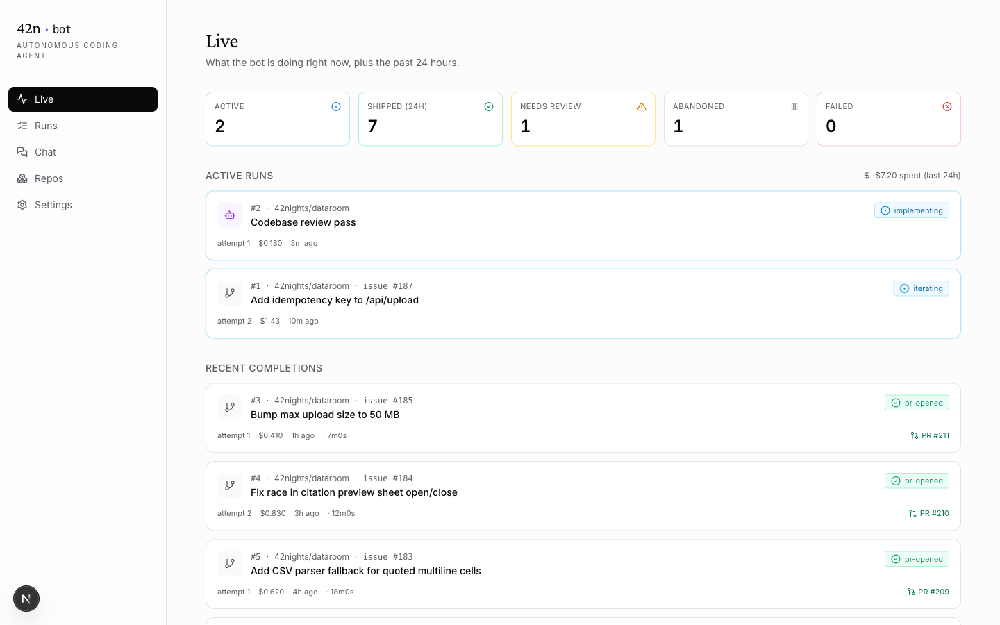
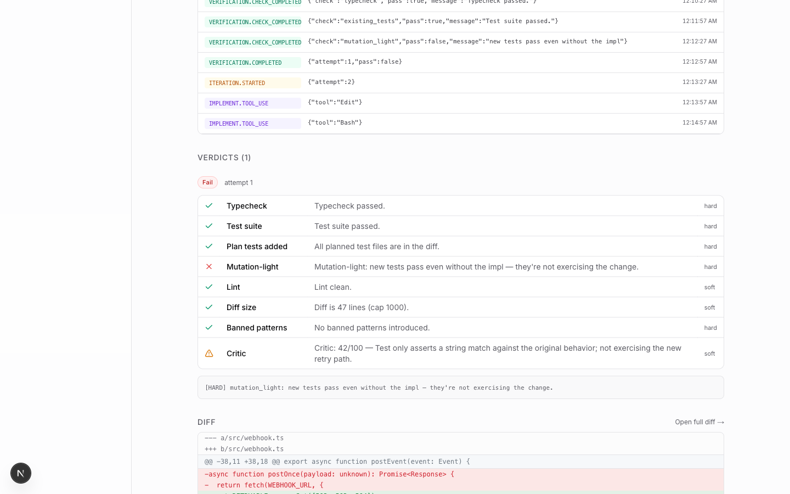
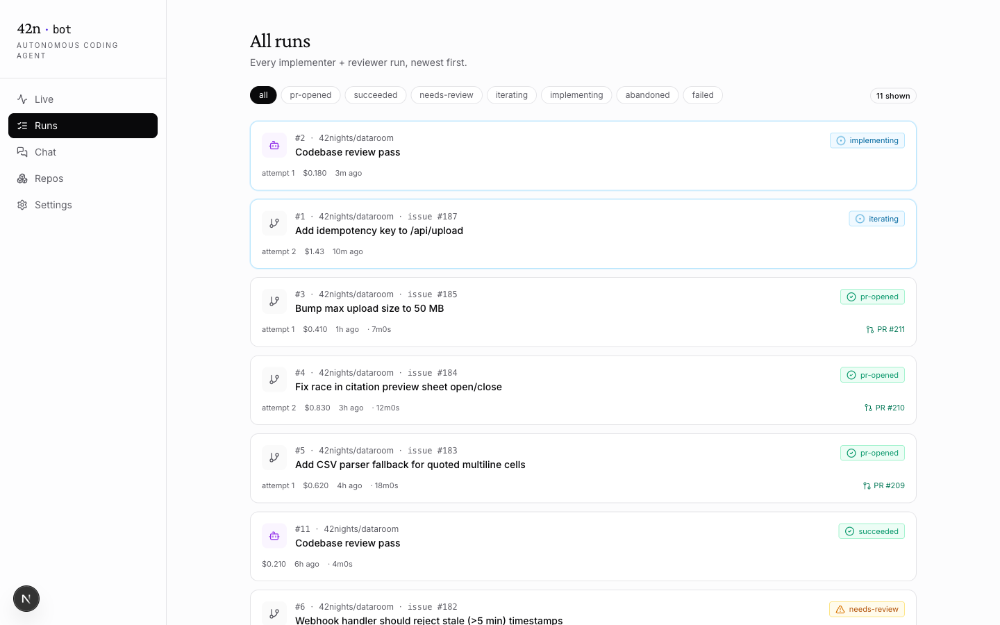
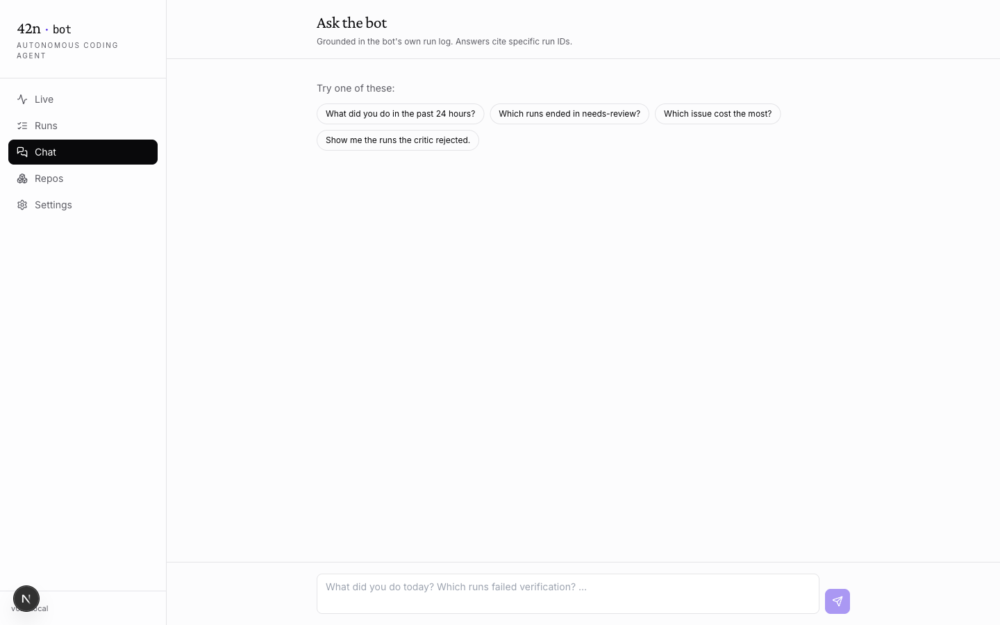
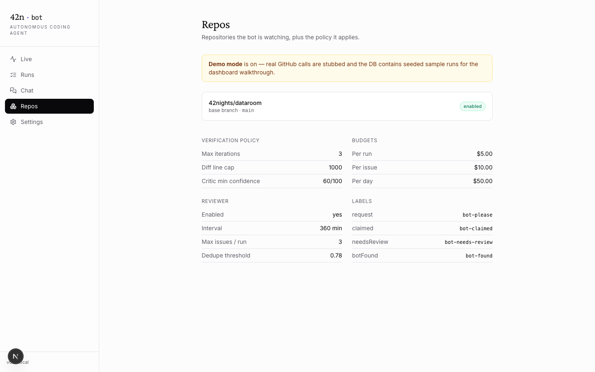

# 42n-bot · by 42nights Inc.

An overnight autonomous coding agent for GitHub. Tag an issue `bot-please`, walk away, wake up to a PR you can read in a minute and merge in two — or to a transparent "I tried, here's where I got stuck" comment if it couldn't.

The whole architecture is organized around one insight: **the model can write the code; the hard part is proving it actually works.** Everything between the issue and the open PR is a verification harness that doesn't trust the agent's self-report.



## What it does

| Surface | Behavior |
|---|---|
| **Implementer** | Picks up issues tagged `bot-please`. Plans → implements → verifies → iterates up to N times → opens a PR with a structured body. If the harness can't be satisfied, the PR ships with `bot-needs-review` and a verification report explaining the gap. |
| **Reviewer** | Walks the codebase on a cron, identifies up to 5 issue candidates per pass (bugs, missing tests, missing docs, code smells, security, perf, a11y). Embedding-based dedupe (cosine ≥ 0.78) against the existing open issue set. Opens at most 3 new issues per pass under the `bot-found` label. |
| **Chat** | Ask the bot what it's been doing. RAG over the bot's own run-and-event log, with run-id citations. |
| **Dashboard** | Live activity feed via SSE, filterable runs table, per-run detail with full event stream + verdict-per-iteration + diff viewer. |

## The verification harness (the centerpiece)

The thing every "agent that writes code" project gets wrong: **trusting the model's `completed: true` flag.** The bot doesn't.

Eight checks run between every implementation attempt and the PR:

| # | Check | Hard gate? | What it actually does |
|---|---|---|---|
| 1 | **Typecheck** | ✅ | `tsc --noEmit` / `cargo check` / `mypy` / `go vet` — autodetected per repo. |
| 2 | **Existing tests** | ✅ | The whole suite. Catches collateral damage to unrelated code. |
| 3 | **Plan tests added** | ✅ | Each `tests_to_add_or_update` path in the plan must appear in the diff. |
| 4 | **Mutation-light** | ✅ | Stash the impl, restore *only* the new tests, re-run — they MUST fail. Pop the stash, re-run — they MUST pass. Proves the tests are exercising the change, not just rubber-stamping it. |
| 5 | **Lint** | ⚠️ | Detected from repo config. Soft gate. |
| 6 | **Diff size** | ⚠️ | Reject diffs > 1000 LOC unless the plan said `complexity: large`. |
| 7 | **Banned patterns** | ✅ | `// @ts-ignore`, `eslint-disable-next-line`, `it.skip`, `xit`, `describe.skip`. The bot doesn't get to silence the rules. |
| 8 | **Critic** | ⚠️ | Separate Claude Haiku call with no skin in the game. Reads the diff + issue + plan and returns `{implements_issue, test_depth, hidden_bugs[], merge_confidence 0-100, one_line_summary}`. Fails the run if confidence < 60, any hidden bug is severity:high, or implementation isn't "yes." |

Failed verification triggers an iteration with structured failure feedback (max 3 by default). If iterations exhaust, the PR opens anyway under `bot-needs-review` with a verification report explaining what blocked it — Ayaan's stated preference over silent confident garbage.



## Stack

- **Next.js 16** (App Router, Turbopack) — dashboard + API + SSE
- **TypeScript strict**, **Tailwind 3**, shadcn-style primitives
- **better-sqlite3** — one file at `./data/bot.db`. `runs`, `events`, `artifacts`, `verdicts`, `corpus_chunks`, `chat_*`.
- **Claude Code CLI** (`@anthropic-ai/claude-code`) — wrapped via `execa` with stream-json parsing, hard timeout, cost budget enforcement, three hang heuristics
- **`@octokit/rest`** + GitHub webhooks (HMAC-SHA256 signature verify, raw-body capture, constant-time compare) + polling fallback
- **`simple-git`** — git worktrees instead of full clones; ~10× faster per issue; auto-reaped after 7 days
- **OpenAI `text-embedding-3-small`** — reviewer dedupe + chat corpus
- **Anthropic Claude Opus 4.7** (chat) + **Claude Haiku 4.5** (critic) — model split chosen for cost/latency
- **`vitest`** — 28 unit tests on the parts that matter (signature verify, banned patterns, diff/plan-tests math, dedupe, PR body, worktree guard)

## Architecture

```
┌─────────────────────────────────────────────────────────────────┐
│ Coordinator daemon (Node + better-sqlite3)                      │
│                                                                 │
│   Implementer loop                                              │
│     pickup → claim (label) → worktree                           │
│     → plan (Claude Code, --json-schema)                         │
│     → implement (Claude Code, --output-format stream-json)      │
│     → verify (8 checks, see above)                              │
│     → iterate up to N times w/ structured feedback              │
│     → push branch, open PR with structured body                 │
│                                                                 │
│   Reviewer loop (every 6h or on demand)                         │
│     → walk codebase                                             │
│     → propose ≤5 issue candidates                               │
│     → embedding dedupe against open issues                      │
│     → open ≤3 new, comment on duplicates                        │
│                                                                 │
│   State (SQLite, single file)                                   │
│     runs · events · artifacts · verdicts · corpus_chunks        │
│     chat_threads · chat_messages                                │
│                                                                 │
│   API (Next.js routes)                                          │
│     GET  /api/runs                  list + 24h rollup           │
│     GET  /api/runs/[id]             detail + verdicts + events  │
│     GET  /api/runs/[id]/events      SSE live stream             │
│     GET  /api/runs/[id]/diff        unified diff                │
│     POST /api/runs/[id]/cancel      soft cancel                 │
│     POST /api/github/webhook        signed inbound events       │
│     POST /api/admin/trigger         manual implementer/reviewer │
│     POST /api/chat                  ask the bot                 │
│     GET  /api/repos                 config snapshot             │
└─────────────────────────────────────────────────────────────────┘
```

## Start

```bash
nvm use                                  # node 22+
npm install
cp .env.local.example .env.local         # ANTHROPIC, OPENAI, GITHUB tokens
npm run migrate
npm run seed:demo                        # populates dashboard with sample runs

# Dashboard (always-on; sources its data from the bot's SQLite)
npm run dev                              # http://localhost:3000

# Coordinator daemon (the long-running process)
REPO_DIR=/path/to/the/repo/main/clone npm run bot
```

For inbound webhooks during dev: run a `cloudflared tunnel --url http://localhost:3000`, register the resulting URL + your `GITHUB_WEBHOOK_SECRET` on the GitHub repo's webhook page. Polling runs alongside (60s) so the bot survives webhook outages.

```bash
npm test                                 # 28 vitest cases
npm run typecheck                        # tsc --noEmit
npm run build                            # next build
npm run trigger:implementer              # CLI fire on a specific issue
npm run trigger:reviewer                 # CLI fire one reviewer pass
```

## Env

| Variable | Required? | Purpose |
|---|---|---|
| `ANTHROPIC_API_KEY` | yes | Claude Code subprocess + critic + chat |
| `OPENAI_API_KEY` | yes | Embeddings (reviewer dedupe + chat corpus) |
| `GITHUB_TOKEN` | yes | Fine-grained PAT with issues + PR write |
| `GITHUB_WEBHOOK_SECRET` | yes | HMAC secret shared with the GitHub webhook |
| `CLAUDE_CODE_PATH` | no | Override if `claude` isn't on PATH |
| `REPO_DIR` | for the daemon | Path to the main checkout that bot worktrees branch off of |
| `WORKTREE_ROOT` | no | Where to park worktrees (default `~/.42n-bot/worktrees`) |
| `DASHBOARD_URL` | no | Deep-link target in PR bodies |
| `DEMO_MODE` | no | Set to `1` to seed sample data instead of hitting GitHub |

## All runs

The filterable runs table at `/runs` is the operational view — every implementer + reviewer run, newest first, scoped by status:



## Chat over the run log

`/chat` is a thin RAG surface over the bot's own event log. Every terminal run gets summarized into a markdown block, embedded via `text-embedding-3-small`, persisted to `corpus_chunks`, and queried per-message. Answers cite specific run IDs back to their detail pages.



## Repos + policy

The bot's policy is file-driven (`bot.config.ts`). The `/repos` page exposes the live shape: which repos it's watching, labels, budgets, reviewer cadence, dedupe threshold.



## Why this architecture

**Minimum scaffold, maximum verification.** Borrowed from [mini-swe-agent](https://github.com/SWE-agent/mini-swe-agent), which scores >74% on SWE-bench Verified with ~100 lines of Python and bash as its only tool. The lesson is that capable models don't need fancy orchestration — they need a *grader* they can't bullshit. We invest engineering attention in the harness, not in the agent loop.

**Why Claude Code CLI as the driver?** It already implements the inner planning + tool-use + file-edit loop. We wrap a tool that already nails the inner game and own the outer game: workspace isolation, verification, iteration, PR opening, cost tracking, audit.

**Why git worktrees instead of clones?** ~10× faster spinup per issue (worktrees share `.git`), instant branch creation, working dir always clean. Tradeoff: needs the orphan reaper (every coordinator startup + every 6h) to keep disk usage bounded.

**Why two refusal paths in the implementer?**
1. *Planner aborts* — bot examines the issue and decides it's too ambiguous, too large, or asks for something dangerous (disabling tests). Posts a comment with the reason, drops the claim label, exits clean. The bot is allowed to say no.
2. *Iteration exhausted* — implementation never satisfies the harness. PR opens anyway under `bot-needs-review` with a full verification report. Ayaan's stated preference: "rather open a transparent failure than ship a confident broken thing."

## File layout

```
src/
├─ coordinator/
│  ├─ index.ts            daemon entry: poll, schedule, recover-on-restart
│  ├─ implementer.ts      pickup → claim → plan → implement → verify → iterate → PR
│  ├─ reviewer.ts         codebase walk + dedupe + bounded issue creation
│  ├─ worktree.ts         create / remove / reap / protected-ref guard
│  ├─ pr-body.ts          structured PR template (verification table + critic summary)
│  ├─ repo-summary.ts     truncated tree for the planner prompt
│  └─ budget.ts           per-run / per-issue / per-day caps
├─ claude/
│  ├─ runner.ts           execa wrapper, stream-json parser, hang heuristics, cost capture
│  └─ prompts.ts          plan + implement + iterate + critic + review prompts (versioned)
├─ verification/
│  ├─ index.ts            orchestrates the 8 checks; persists verdict per attempt
│  ├─ detect.ts           autodetect test/typecheck/lint from package.json + Cargo.toml + …
│  ├─ run.ts              shell wrapper that never throws on non-zero
│  ├─ typecheck.ts        check 1
│  ├─ tests.ts            check 2
│  ├─ diff.ts             checks 3 + 6 (plan-tests-added, diff size)
│  ├─ mutation.ts         check 4 (stash-and-prove)
│  ├─ lint.ts             check 5
│  ├─ banned.ts           check 7
│  └─ critic.ts           check 8 (Claude Haiku, tool-use schema-bound)
├─ github/
│  ├─ client.ts           octokit wrapper (list/label/comment/create-issue/open-PR)
│  ├─ webhook.ts          HMAC-SHA256 raw-body verify, constant-time compare
│  └─ issue-dedupe.ts     embedding-cosine duplicate detection
├─ chat/
│  ├─ corpus.ts           run → markdown summary → embed → store
│  └─ answer.ts           retrieve top-K → Claude with citations
├─ embeddings/openai.ts   text-embedding-3-small (normalized, dot=cosine)
├─ db/
│  ├─ schema.sql · index.ts · migrate.ts
└─ shared/
   ├─ logger.ts · events.ts (typed emitEvent helper)

app/
├─ page.tsx               live activity feed (SSE)
├─ runs/page.tsx          filterable runs table
├─ runs/[id]/page.tsx     detail + verdicts + event stream + diff
├─ runs/[id]/diff/page.tsx full diff
├─ chat/page.tsx          ask the bot
├─ repos/page.tsx         config snapshot
├─ settings/page.tsx
└─ api/…                  see Architecture section

bot.config.ts             single source of truth for labels, budgets, intervals, policy
```

## Test surface

```
test/
├─ signature.test.ts      5  GitHub HMAC verify: tampered body / wrong secret / missing prefix
├─ banned.test.ts         5  banned-pattern scan, including context-line false-positive guard
├─ diff.test.ts           7  diff-size cap (incl. 2× for complexity:large) + plan-tests-added
├─ dedupe.test.ts         3  reviewer cosine-threshold dedupe with mocked embeddings
├─ pr-body.test.ts        6  template snapshots: passing run, needs-review with WARNING block
└─ worktree-guard.test.ts 2  protected-ref refusal (main/master/trunk/develop)
```

`npm test` runs all 28 in under a second.

## What's intentionally out of scope (for now)

- **PR auto-merge.** v0 default: never. Bot opens PRs, humans merge them. Per Ayaan's check-in.
- **Multi-repo concurrency.** One implementer run at a time per repo (atomic claim via label + run-row UNIQUE constraint). Reviewer can run on a different repo in parallel.
- **MCP servers.** `--bare` skips all auto-discovery for deterministic runs across machines. Worth a v0.5 if the bot ever needs a project-specific tool.
- **Token-by-token streaming on the chat surface.** SSE is wired for run events; chat responses come back as a single payload. Adding streaming is a 1-hour swap when needed.

## Caveats

- **June 15, 2026:** Anthropic moves `claude -p` on subscription plans to a separate Agent SDK credit pool. If the bot uses subscription auth, billing config needs an update past that date. Pay-per-use via `ANTHROPIC_API_KEY` is unaffected. (Per [Anthropic's headless docs](https://code.claude.com/docs/en/headless).)
- **Local-first, not multi-tenant.** One coordinator daemon per `bot.db`. Multi-repo within a single daemon works; multi-org needs separate deployments.
- **Webhook reachability:** the dashboard is a Next.js app — easy to expose. The coordinator daemon doesn't need to be public, only the dashboard's `/api/github/webhook`. A `cloudflared tunnel` is enough for the local-dev case.

---

*v0.1 · the verification harness is the centerpiece · everything else is plumbing*
