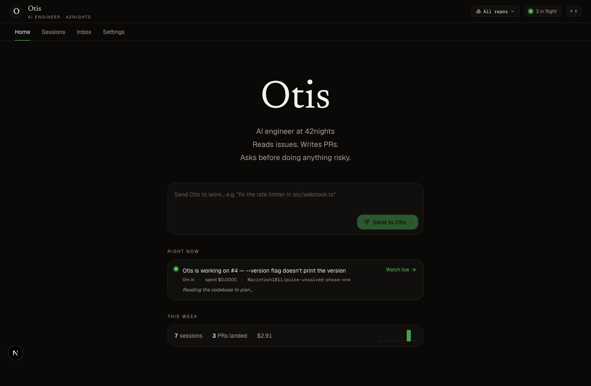
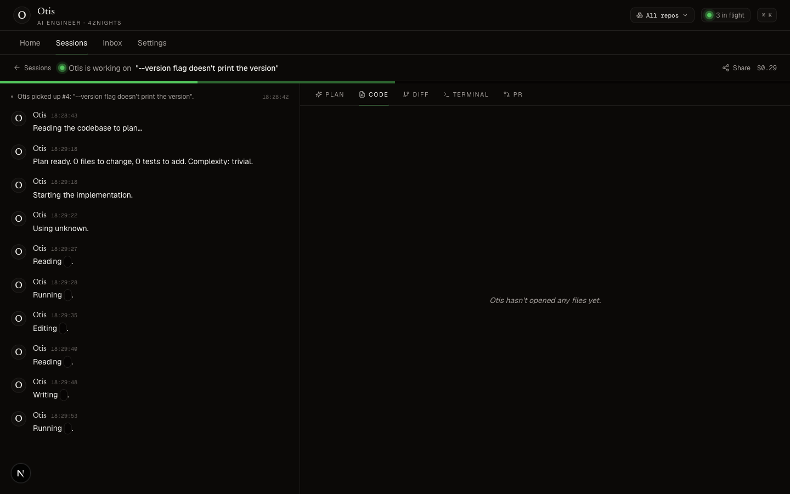
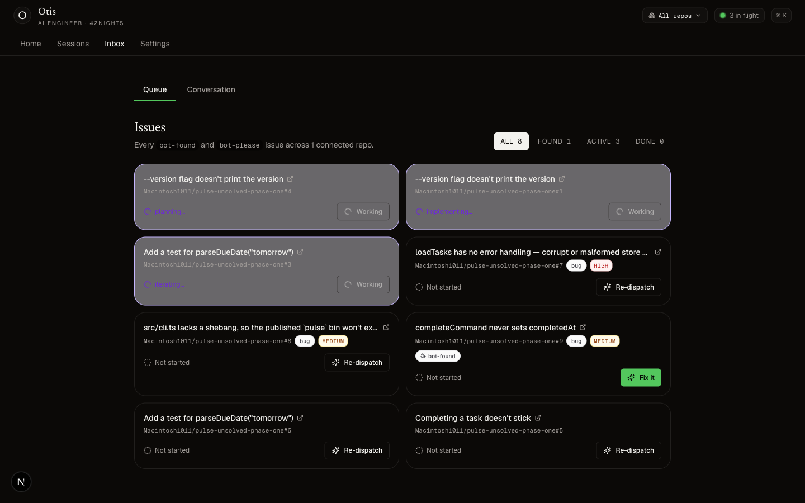
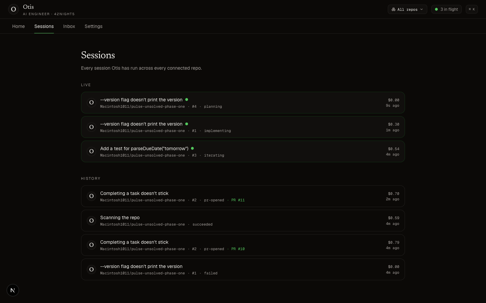
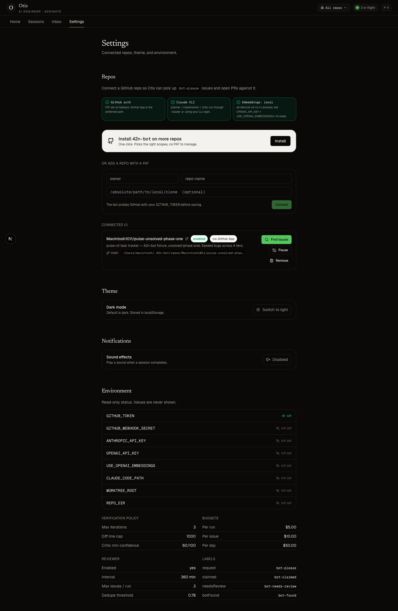

# Otis · the AI engineer at 42nights

> Reads issues. Writes PRs. Asks before doing anything risky.

Otis is an autonomous coding agent that lives on your dashboard. Drop a `bot-please` label on a GitHub issue (or click **Fix it** from his Inbox) and walk away — wake up to a PR you can read in a minute and merge in two, or a transparent "I tried, here's where I got stuck" comment if the harness couldn't be satisfied.

The architecture is organized around one insight: **the model can write the code; the hard part is proving it actually works.** Everything between the issue and the open PR is a verification harness that doesn't trust the agent's self-report.



---

## What you actually do

1. Open http://localhost:3000.
2. Click **Create GitHub App** (one click on github.com, App appears in your account) → **Install** on the repos you want Otis on.
3. Either:
   - Type into the **Send Otis to work** box on the home page, or
   - Open the **Inbox**, find a `bot-found` issue Otis has surfaced from a scan, and click **Fix it**, or
   - Label any GitHub issue `bot-please` from github.com directly.
4. Watch the session unfold live — narration on the left, code/diff/terminal/PR on the right.

That's it. No env-file editing. No PATs. No webhooks-during-dev tunnel setup. The polling coordinator picks new work up within 60s; the dispatch channel routes the **Fix it** button to a 2s pickup.

---

## The product surface

### The session workspace — watching Otis work

Each session is a split-pane workspace. Otis's narration on the left translates raw events into engineering language; the right pane is a 5-tab artifact view: **Plan / Code / Diff / Terminal / PR**. Tabs auto-advance with the phase; you can pin one via `?tab=`.



The narration is fed by `lib/narration.ts` — a pure translator that turns `implement.tool_use { name: "Edit", input: { file_path: "src/foo.ts" } }` into *"Editing `src/foo.ts`."*. Successful verification checks are skipped (noise); failures get system-level annotation. Same-file edits within 8 seconds coalesce into one bubble whose timestamp updates in place.

When the run terminates, a 56px **time-travel scrubber** appears at the bottom. Drag the handle, hit play, watch the agent's session replay at 1×/2×/4×/10× — phase ticks under the track snap to plan/implement/verify/PR moments. Every session has a `/sessions/{id}/share` URL that opens to a public read-only view with auto-generated open-graph cards for iMessage/Slack unfurls.

### The inbox — every issue Otis can see

A live grid of every `bot-found` (Otis filed it himself) and `bot-please` (someone tagged it) issue across every connected repo, joined with local run state. Filter pills for All / Found / Active / Done. One-click **Fix it** labels the issue and pokes the coordinator's dispatch channel.



When a session for an issue is in flight, the card lights up violet with the current phase. When the PR is open, it links there directly. When the run failed, it offers a one-click re-dispatch.

### The sessions list — history



Active sessions float to the top. Cost, PR number, status, time relative — all in the row. Click in for the workspace.

### Settings — repos, theme, env

Everything from the GitHub App install state to the env-var matrix lives here. Repos can be cloned from the UI directly, paused per-repo, removed, or have their local clone path overridden.



---

## The verification harness (the centerpiece)

Most "agent that writes code" projects trust the model's `completed: true` flag. Otis doesn't.

Eight checks run between every implementation attempt and the PR:

| # | Check | Hard gate? | What it actually does |
|---|---|---|---|
| 1 | **Typecheck** | ✅ | `tsc --noEmit` / `cargo check` / `mypy` / `go vet` — autodetected per repo. |
| 2 | **Existing tests** | ✅ | The whole suite. Catches collateral damage to unrelated code. |
| 3 | **Plan tests added** | ✅ | Each `tests_to_add_or_update` path in the plan must appear in the diff. |
| 4 | **Mutation-light** | ✅ | Stash the impl, restore *only* the new tests, re-run — they **must fail**. Pop the stash, re-run — they **must pass**. Proves the tests are exercising the change, not just rubber-stamping it. |
| 5 | **Lint** | ⚠️ | Detected from repo config. Soft gate. |
| 6 | **Diff size** | ✅ | Capped at 1000 lines (configurable), 2× for `complexity: large` plans. |
| 7 | **Banned patterns** | ✅ | `@ts-ignore`, `it.skip`, `describe.skip`, `xit`, `eslint-disable-next-line`. False-positive guard for context-only diff lines. |
| 8 | **Critic** | ⚠️ | Claude Haiku reviews the diff against the issue with `tool_use` JSON output. Confidence ≥ 60 + `implements_issue === "yes"` + no high-severity hidden-bug flags to pass. Soft gate, but its verdict is in the PR body. |

If hard gates fail, the implementer iterates (up to 3 attempts). If they still fail, the PR ships under `bot-needs-review` with a full verification report.

---

## Architecture

### Three processes, one DB

- **Dashboard** — Next.js 16 (App Router, Turbopack) on :3000. Render + REST + SSE.
- **Coordinator** — long-running Node process (bundled via esbuild). Polls GitHub every 60s, drains the dispatch channel on a 2s tick, runs the reviewer on its schedule, owns worktree recovery.
- **Claude Code subprocess** — spawned per implementer phase with `acceptEdits` permission and an allow-listed tool set scoped to plan vs implement vs critic.

All three read/write the same `better-sqlite3` DB at `data/bot.db` — single source of truth for runs, events, verdicts, artifacts, repos, app credentials, corpus chunks, chat threads.

`npm run go` starts the dashboard + coordinator side-by-side under `concurrently`.

### The agent identity

The agent is **Otis**. He has a monogram avatar (a serif "O"), a one-line bio (*"AI engineer. Reads issues, writes PRs, asks before doing anything risky."*), and a voice in copy — terse, specific, backticks around filenames, no exclamation points, no emoji unless the user uses one first. The terminology is collaborator language: *sessions* not *runs*, *Otis edited `foo.ts`* not *implement.tool_use*, *needs your eyes* not *needs-review*.

### GitHub App auto-install

You don't paste a PAT. The **Create GitHub App** button serves a manifest form that pre-fills github.com/settings/apps/new with the right scopes (Contents/Issues/Pull requests/Metadata + Workflows R/W). One approve click on github.com, GitHub redirects back with a one-time exchange code, the callback POSTs to `/app-manifests/{code}/conversions` to mint full credentials, and we persist them to the `app_credentials` singleton table. Installation-token caching + per-repo routing via `ghFor(owner, repo)`.

### Local embeddings by default

Reviewer dedupe + chat corpus search use `Xenova/all-MiniLM-L6-v2` via `@huggingface/transformers` in-process (~25MB one-time download, 384-dim vectors, ~50ms/embed). `OPENAI_API_KEY` is fully optional now — set `USE_OPENAI_EMBEDDINGS=1` only if you want to swap back to `text-embedding-3-small`.

### Claude Code CLI for everything

No `ANTHROPIC_API_KEY` required. Planner, implementer, critic, and the chat synthesizer all run through `claude -p` subprocesses using the CLI's OAuth login. `spawnEnv()` strips `ANTHROPIC_API_KEY` / `ANTHROPIC_AUTH_TOKEN` from the child env so a stale key in your shell doesn't override the CLI's keychain credentials.

---

## Install + run

```bash
# 1. Clone and install
git clone https://github.com/42nights/42n-bot.git
cd 42n-bot
npm install

# 2. Make sure the Claude CLI is logged in
claude   # opens REPL → /login → approve in browser → Ctrl+D

# 3. Optional .env.local (everything has sensible defaults)
cp .env.local.example .env.local
# Only GITHUB_TOKEN is needed if you skip the GitHub App auto-install.

# 4. Start everything
npm run go
```

Then http://localhost:3000 → **Create GitHub App** → **Install** on a repo → label an issue.

```bash
npm test           # 54 vitest cases
npm run typecheck  # tsc --noEmit
npm run build      # next build + esbuild bot bundle
npm run build:bot  # just the bot bundle
```

## Env

Everything is optional except a way to reach GitHub. The GitHub App install flow handles that with zero env vars.

| Variable | Required? | Purpose |
|---|---|---|
| `GITHUB_TOKEN` | only if you skip the App install | Fine-grained PAT fallback |
| `CLAUDE_CODE_PATH` | no | Override if `claude` isn't on `PATH` (defaults to `claude`) |
| `REPOS_ROOT` | no | Where to clone connected repos (default `~/.42n-bot/repos`) |
| `WORKTREE_ROOT` | no | Where to park bot worktrees (default `~/.42n-bot/worktrees`) |
| `DASHBOARD_URL` | no | Deep-link target in PR bodies (default `http://localhost:3000`) |
| `USE_OPENAI_EMBEDDINGS` | no | Set to `1` to force OpenAI embeddings instead of local |
| `OPENAI_API_KEY` | only with `USE_OPENAI_EMBEDDINGS=1` | OpenAI auth |
| `GITHUB_WEBHOOK_SECRET` | only if you wire a webhook | Shared HMAC secret |
| `USE_ANTHROPIC_API_KEY` | no | Set to `1` to opt back into API-key auth instead of CLI OAuth |

## File layout

```
src/
├─ coordinator/
│  ├─ index.ts            daemon entry: poll, drain dispatch, recover-on-restart
│  ├─ implementer.ts      pickup → claim → plan → implement → verify → iterate → PR
│  ├─ reviewer.ts         codebase walk + dedupe + bounded issue creation
│  ├─ worktree.ts         create / remove / reap / clearGitLocks / branch cleanup
│  ├─ pr-body.ts          structured PR template with verification table
│  └─ dispatch.ts         cross-process signal so /Fix it dispatches within 2s
├─ claude/
│  ├─ runner.ts           execa wrapper, stream-json parser, hang heuristics
│  ├─ headless.ts         one-shot `claude -p` for planner / critic / chat
│  └─ prompts.ts          plan + implement + iterate + critic + review prompts
├─ verification/          orchestrator + 8 checks (see §verification harness)
├─ github/
│  ├─ client.ts           Octokit wrapper; ghFor(owner, repo) routes inst-token
│  ├─ app.ts              JWT minting, install token cache, manifest creds
│  ├─ webhook.ts          HMAC-SHA256 raw-body verify
│  └─ issue-dedupe.ts     embedding-cosine duplicate detection
├─ chat/
│  ├─ corpus.ts           terminal run → markdown → embed → store
│  ├─ answer.ts           retrieve top-K + live-runs context → CLI → citations
│  └─ live-runs.ts        snapshot of in-flight runs for chat context
├─ embeddings/
│  ├─ index.ts            backend router (local default, OpenAI opt-in)
│  ├─ local.ts            transformers.js, Xenova/all-MiniLM-L6-v2
│  └─ openai.ts           text-embedding-3-small (kept for opt-in)
├─ repo-store.ts          DB-backed connected repos + activeRepos()
├─ repo-clone.ts          installation-token-aware git clone + idempotent fetch
├─ db/                    schema.sql, index.ts, migrate.ts
└─ shared/                logger.ts, events.ts

app/
├─ page.tsx               Otis landing — hero, prompt, active session, week stats
├─ sessions/page.tsx      sessions list (active first)
├─ sessions/[id]/page.tsx the session workspace (narration + 5 tabs + scrubber)
├─ sessions/[id]/share/   public read-only + opengraph-image
├─ inbox/page.tsx         Queue + Conversation tabs
├─ settings/page.tsx      repos + theme + sounds + env-var matrix
├─ api/
│  ├─ github/app/         setup + setup-callback + install callback + info
│  ├─ issues/             list + /fix (label + dispatch)
│  ├─ repos/[id]/         get/patch/delete + /clone + /review
│  ├─ sessions/start/     "Send Otis to work" → opens a GitHub issue
│  ├─ sessions/[id]/file/ Code-tab file fetch from worktree/clone
│  └─ runs/[id]/events    SSE event stream
└─ globals.css            oklch token system (dark default)

components/
├─ Shell.tsx              top-bar layout with RepoSelector + ⌘K chip
├─ NarrationStream.tsx    Otis's voice rendered with thinking cursor
├─ SessionWorkspace.tsx   5-tab workspace shell
├─ workspace/             PlanTab, CodeTab (Monaco), DiffTab, TerminalTab, PrTab
├─ Scrubber.tsx           time-travel strip
├─ CommandPalette.tsx     cmdk, ⌘K, sessions + issues + actions
├─ RepoSelector.tsx       top-bar dropdown that scopes the whole dashboard
├─ CelebrationListener.tsx one-shot confetti on pr.opened
└─ icons/                 OtisMark, LiveDot, ScrubberHandle

lib/
├─ narration.ts           events → Otis-voice translator
├─ replay.ts              client-side replay engine for the scrubber
├─ repo-scope.ts          ?repo= URL state hook
├─ celebrate.ts           confetti + sfx
└─ hooks.ts               useActiveCount (scope-aware)

bot.config.ts             labels, budgets, intervals, policy
```

## Test surface

```
test/
├─ extract-json.test.ts       20  CLI JSON extraction: fences, prose, nested, mismatched, O(n) perf
├─ narration.test.ts          15  Otis-voice translator across event kinds + coalescing
├─ stream.test.ts             12  ndjson parser: tool_use shapes, hang heuristics, cost capture
├─ security.test.ts          12  RCE / exfil / host-redirect rejection (isCommandSafe, isSafeGitHubName)
├─ cron-store.test.ts        11  schedule validation, nextFireAt, payload size/shape guards
├─ diff.test.ts               9  diff-size cap (incl. empty=0), plan-tests exact-match
├─ pr-body.test.ts            6  template snapshots: passing run, needs-review with warnings
├─ cron-fire-safety.test.ts   5  atomic claim + FK-safe history insert
├─ signature.test.ts          5  GitHub HMAC verify: tampered body, wrong secret, missing prefix
├─ banned.test.ts             5  banned-pattern scan, false-positive guard
├─ understand-validate.test.ts 5  fabrication / ubiquitous-padding / sibling-escape detection
├─ parse-requests.test.ts     4  implementer escape-hatch parser
├─ dedupe.test.ts             3  reviewer cosine-threshold dedupe (mocked router)
├─ git-locks.test.ts          3  clearGitLocks idempotency + safe scope
├─ worktree-guard.test.ts     2  protected-ref refusal (main/master/trunk/develop)
└─ verification-harness.test.ts 1  end-to-end harness on a real git repo
```

`npm test` runs all 118 cases (117 unit in ~1s + one e2e in ~15s).

### Hardening

The codebase went through six rounds of adversarial multi-agent QA — each
round fans specialized auditors across the subsystems, every finding is
independently verified by a skeptic that tries to *refute* it, and only
confirmed-real bugs are fixed. The confirmed-finding count converged
23 → 5 → 9 → 1 across the rounds; the final round found no correctness or
security bug in normal operation. Closed along the way: a schema bug that
silently skipped the acceptance gate on feature runs, a reviewer-concurrency
race that filed duplicate issues, command-injection and path-traversal
surfaces in the runtime-verification + clone paths, a prompt-injection vector
in the chat RAG, several SQLite atomicity/race holes, and an O(n²) JSON
parser. Security-critical paths (webhook sign→dedup→replay, command
allowlist, path-traversal guards) are covered by regression tests and were
verified end-to-end against a live server.

## Why this architecture

**Minimum scaffold, maximum verification.** Borrowed from [mini-swe-agent](https://github.com/SWE-agent/mini-swe-agent), which scores >74% on SWE-bench Verified with ~100 lines of Python and bash as its only tool. The lesson: capable models don't need fancy orchestration — they need a *grader they can't bullshit*. Engineering attention goes into the harness, not the agent loop.

**Why Claude Code CLI as the driver?** It already implements the inner planning + tool-use + file-edit loop. We wrap a tool that already nails the inner game and own the outer game: workspace isolation, verification, iteration, PR opening, cost tracking, audit.

**Why git worktrees instead of clones?** ~10× faster spinup per issue (worktrees share `.git`), instant branch creation, working dir always clean. Tradeoff: needs the orphan reaper (every coordinator startup + every 6h) to keep disk usage bounded.

**Why a GitHub App with auto-install instead of PATs?** Per-install scoping, higher rate limits, no rotation, no shared secret to leak. The manifest flow means you click "Create" once and "Install" once — that's the whole setup.

**Why two refusal paths in the implementer?**
1. *Planner aborts* — Otis examines the issue and decides it's too ambiguous, too large, or asks for something dangerous. Comments the reason, drops the claim label, exits clean. The bot is allowed to say no.
2. *Iteration exhausted* — implementation never satisfies the harness. PR opens anyway under `bot-needs-review` with a full verification report. *Rather a transparent failure than a confident broken thing.*

## What's intentionally out of scope (for now)

- **PR auto-merge.** v0 default: never. Otis opens PRs, humans merge them.
- **Multi-repo concurrency.** Up to 3 concurrent implementer runs total. Reviewer can run on a different repo in parallel.
- **MCP servers.** Each subprocess runs with a tightly-scoped allow-list; no auto-discovery of project-specific tools.
- **Token-by-token chat streaming.** SSE is wired for run events; chat responses come back as a single payload. ~1-hour swap when needed.

## Caveats

- **Local-first, not multi-tenant.** One coordinator daemon per `bot.db`. Multi-repo within a single daemon works; multi-org needs separate deployments.
- **Webhook reachability:** dev-mode polling is the default. To wire webhooks for sub-minute latency, expose `/api/github/webhook` via `cloudflared tunnel --url http://localhost:3000` and configure the App's webhook URL + secret.

---

*v0.1 · the verification harness is the centerpiece · everything else is plumbing*
